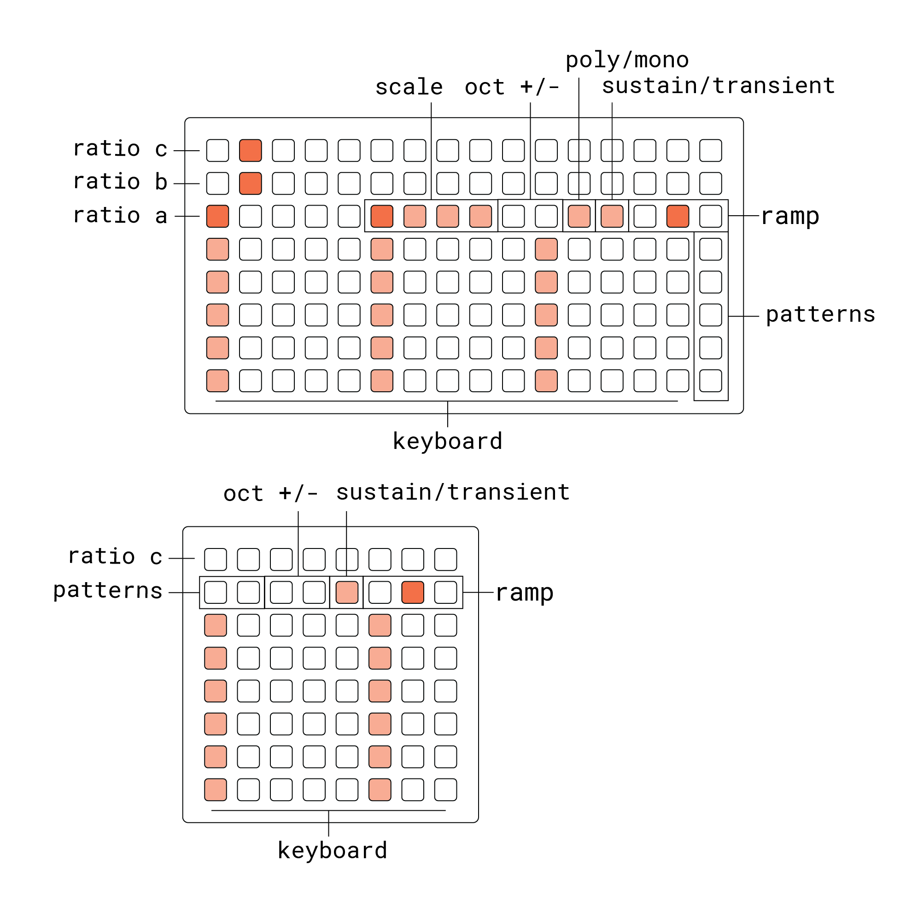

 

  

 

a 3-operator FM synth with fx. inspired by yamaha portasound keyboards

### [--video--]()

### requirements

- norns (210927 or later)
- grid (any size) or midi keyboard
- audio input (optional)
- midi mapping encouraged

### install

run `;install https://github.com/andr-ew/orgn` in the maiden repl, then run SYSTEM > RESTART to boot the new engine

***POSSIBLE STROBE WARINING*** on the screen graphics for this script. I'll add an option to disable the graphics as soon as I get a chance

# documentation

orgn is a 3-operator FM synthesizer followed by an FX engine which loosley emulates yamaha's ultra-cheap range of consumer keyboards from the 80's & 90's - the PortaSound series. whereas these keyboards were locked into 100 or so sometimes corny factory presets (with a catchy demo song to match), orgn gives you full control over the synthesis & fx engines. you can also process external signals through the FX via the norns inputs.

if you like reading, the documentation below provides some detailed technical explanations of most of the controls available, and provides some basic explanation of FM synthesis. if you don't like reading, I made a short [video]() that shows you what all orgn can do - that alone should be enough to get you started. synthesis is about experimentation, so don't feel like you need to know everything before diving in !

## grid

## screen

the norns screen has three pages of controls, which can be mapped to anything in the params menu

- **K1/K2:** page
- **E1-E3:** edit control

the default mappings, along with the controls available on the grid, are designed to get you up & running quickly with orgn without getting buried in options. once you've gotten familiar with these, you can dive into the params menu, map additional params to external [midi controllers](https://github.com/andr-ew/bleached)/OSC, or edit the screen mappings via PARAMS > EDIT > map > encoders

## parameters

### oscillators

- **amp [a/b/c]**: the amplitude or volume of the three sine waves in the synth voice

  by default, the amplitutes are:

  | a | b | c |
  | - | - | - |
  | 1.0 | 0.5 | 0.0 |

  generally for FM synthesis, any 0 (silent) wave would be considered a modulator wave while any non-zero (audible) wave would be considered a carrier wave. so by default you have two carrier waves (**a** & **b**) and one modulator wave (**c**). we'll expand more on modulator & carrier in the next bullet point
  
  if you like, you can also use orgn as a simple addative synthesizer, just by manipulating the levels of these three sines (this gets especially tasty with the **detune** param). there are a suprising variety of organ tones and muted piano sounds to be found this way !
  
- **pm [a/b/c] -> [a/b/c]**: this flavor of param sets the level (or _index_) of modulation between two sine waves.

  on the left side of the arrow you'll normally have your modulator (silent) wave and on the right you'll have the carrier (audible) wave. increasing the **pm** level turns the plain sine wave into a progressively brighter tone, a bit like opening the filter on an oscillator.
  
  by default on the norns screen, you have access to **pm c -> b** and **pm c -> a**, which routs our single modulator wave to our two carrier waves. 
  
  in the params menu, you have access to _every_ possible routing between two waves, including feedback. however, it's often more informative & musical to focus on just one or two routings at a time - that way it's always easy to transition between bright tones and pure sine waves.
  
  (for the nerds: the term PM is used here rather than FM as phase modulation is actually used under the hood. this is the case for many of the synthesiszers which are labelled as FM synthesiszers.)
  
- **ratio [a/b/c]**: the third key parameter in FM syntheis is the pitch or _ratio_ of the sine waves used for synthesis. these can be controlled on the grid or in the params menu. 

  each key on the top 2 rows of the grid (and 1/8 of the third row) represents a whole-number multiple of the pitch being played on the keybaord (also known as the harmonic series). the default ratios are: 
  
  | a | b | c |
  | - | - | - |
  | 1 | 2 | 4 |
  
  this means that the two carriers are heard an octave apart, and the modulator is an octave above carrier **b**, and two octaves above carrier **a**. this is why the two default modulation routings produce different timbres in each carrier.
  
  each ratio of modulator to carrier has a unique timbre. simpler ratios (1:2, 1:4, 1:3, 2:3, 1:8) tend to have a more _harmonic_ timbre while complex ratios (3:5, 1:7, 1:15, 13:17) have more _inharmonic_ or bell-like timbres. 
  
  play around with silencing carrier **a** (in the params menu) and listening to modulation between **c** & **b** while playing with different ratios on the grid. (you'll probably want to take advantage of the octave keys to keep complex ratios in your pitch range)
  
- **detune**: one of the key characteristics of digital sounds compared to analog or acoustic ones is that, by default, all waves will be _perfectly_ in tune with each other, wheras in the latter cases there will be slight or extreme imperfecttions in pitch ratios. the **detune** parameter lets you circumvent this in the digital realm - adding slight imperfections between the sine wave pitches can lend an analog feel to FM patches or set up acoustic beating tones between pure sines.

### envelope

- **time**: the envelope is the volume over time of the three sines. increase the time control to slow down the tranistion from silent to audible. **time** will affect the _attack_ and/or _release_ of the envelope depending on the **ramp** setting
- **ramp**: ramp (on the grid) affects affects the shape or "direction" of the envelope. at the default 0 position (middle key), the envelope will have both an attack and a release. at the 1 position (right key) the envelope will have a release and fast attack, at the -1 position you'll have a reverse envelope, with a slow attack and fast release
- **sustain/transient**: when this key is high, the sustain portion of the envelope will be removed - so a keypress will trigger a temporary or transient sound regardless of how long the key is held. this is useful for plucked sounds with a high **ramp** and short **time**
- **span**: similar to **detune**, span adds some variation in the envelope time across the three sines. this can lend itself to a more natural or acoustic feel, and can also be used to create changes in brightness over time, since you can slow down to attack or release of the modulator compared to the carrier.

### fx

- **dry/wet**: dry/wet sets the volume or prominence of the effected signal
- **samples**: this sets the samplerate of the fx engine, which is sort of like the framerate of a video game. lowering the sample rate leads to distortions and high pitched aliasing tones.
- **bits**: bits affects the bit depth of the effected signal, kind of like the resolution of your orgn SNES rom. audibly, it's a square-wave like distortion with digital noise tied to the dynamics of the input

  from the params menu you can alter a few more characteristics of the fx engine, but those are all a bit mysterious, and sometimes explosive (!)

## tuning

by default, the keyboard section of the grid will be tuned to C major pentatonic, with an octave between rows. there are quite a few tuning options available however, including just intonnation, arabic maqam, and many options for custom scales. these are organized into 4 scale presets which can be recalled on the grid. hold a **scale** key or **K1** to enter the tuning screen.

 

  

- **tuning**: this selects the tuning system used - the default is 12-tone equal temperment. other options include maqam (scales with quarter-tones) and variations of just intonnation.
- **root**: set the root note of the scale. this will always be a 12tet interval starting from 440 hz (black keys in the first row, white keys on the bottom). you can use the **pitch** param for fine-tuning if needed.
- **scale**: this selects a scale within the chosen tuning system. scales from `musicutil` are used for 12tet and just intonnation modes, while a few maqam have been transcribed for the maqam mode.
- **scale degrees**: these keys allow you to remove/narrow down notes from the selected scale. by starting from a chromatic scale, custom scales can be designed
- **rows**: this sets the interval between rows on the keyboard - switching from octaves to 5ths or 7ths can be a really nice way to mix up your improvisations if things start getting stale.

if you'd like some more scales or tuning modes to be available (especially non-western ones) feel free to let me know ! contributions are welcome.

## pattern recording

there are five pattern recorders rightmost on the grid. these can record & loop keyboard gestures, FM ratio changes, envelope settings, and encoder movements. you can also change the scale while a pattern is playing back to add key changes or chord progressions to a loop. each pattern is controlled by a single grid key:
- single tap
  - (blank pattern): begin recording
  - (recording pattern): end recording, begin looping
  - (playing pattern): play/pause playback
- double tap: overdub pattern
- hold: clear pattern

# API docs

(forthcoming)

# thanks to

- rodrigo constanzo
- ezra buchla
- @justmat + @ganders 

for various code snippets & jumping off points for the effects engine

- trent gil

for inspiration on FM & envelope parametization (w/ synth & just friends)

# future maybe

known bugs / issues
- currently i don't have a polyphony limit implemented -- in transient mode with longer envelopes it can be pretty easy to blow up the engine
- there are some performance issues, sadly. this can be noticeable when playing quickly, uhh, sometimes? restarting the script always seems to get things back to normal. optimization is a weak spot for me so it's going to take me time to sort this out.
- still not really happy with the fine tuning on span, oh well

roadmap
- encoder quick mapping
- global PM scaler
- arc support
